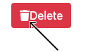

# 03 Exercise - Styled Components

## Scenario

Your team has been steadily improving the Todo App and the business has been working on its five year plan. At present there is uncertainty whether the Todo App is going to be re-branded next year, so for this year as a starting point your team has been building patterns into the code that will make it enforce visual consistency and be simpler to maintain.

## Brief

Your tech lead has refactored the code so that all of the buttons in the app are now created by one component, `Button.js`. During this process the different buttons seem to have lost some of their colours and styles. Your tech lead has asked you to use [Styled Components](https://styled-components.com/docs/basics) to apply colours and styles to the various buttons in the app.

## Getting Started

To run the existing Todo app run

```zsh
docker-compose up --build
```

## Instructions

### Part A - Use Styled Components to Style a Component

Install the [Styled Components](https://www.npmjs.com/package/styled-components) package into your `client` folder and import Styled Components into your client's `Button.js` file using:

```zsh
  import styled from "styled-components";
```

_Don't Forget: You will need to purge the volumes of your Docker Container and rebuild it so that it includes the new node module you have added_

In `Button.js` create a `StyledButton` component which renders a `<button>` tag with some styles.

**Handy hint: [How To Use Styled-Components In React - Starting Out](https://www.smashingmagazine.com/2020/07/styled-components-react/#starting-out)**

Improve the style shared by all the buttons. Add styles to the `StyledButton` styled component that:

- remove the default border from the buttons
- give the buttons a border radius
- give the styled button component consistent padding around the outside

**Acceptance criteria**

- A `StyledButton` styled component is created and used in `Button.js`.
- The default button styles are added to the `StyledButton` styled component.

### Part B - Add Styles Based on Props

There are currently five types of buttons in the Todo app. Give each of these buttons a different background colour as follows. Give the buttons white text where appropriate.

**background colours:**
'add' = #15872f
'edit' = #ffc107
'delete' = #dc3545
'exit' = #dc3545
'close-modal' = transparent

**Handy hint: [Add styles based on props](https://www.smashingmagazine.com/2020/07/styled-components-react/#adapting-based-on-props)**

**Acceptance criteria**

- A different background color is applied to each button type.

### Part C - Extending Styles

You realise that something is looking a little bit off with the spacing of the elements within the buttons. 



Create more space between the button icon and button text.

To do this create a new styled component `StyledIcon` based on the `<FontAwesomeIcon />` component with a style rule for right margin.

See [Extending Styles](https://styled-components.com/docs/basics#extending-styles).

**Acceptance criteria**

- A new styled component `StyledIcon` based on the `<FontAwesomeIcon />` component with a style rule for right margin is created and used in `Button.js`.

### Part D - Use Global styles

There are some particular parts of the app that require extra emphasis - the app title and the instance of the edit button that is inside the modal. Your tech lead made a start implementing this styling:

- they have added a class called `emphasis` onto both of these elements.
- they have installed the google font [Fredoka One](https://fonts.google.com/specimen/Fredoka+One?thickness=7#standard-styles) with the intention of using it to style the `emphasis` class.

We should consider the `emphasis` class a global style since it will be used in different components across the app.

Use the Styled Component's [Global Styling](https://styled-components.com/docs/api#createglobalstyle) `createGlobalStyle` helper function to add your `emphasis` global styles to the app.

In the `client/src/index.js` file:

- Import `createGlobalStyle`
- Define the `GlobalStyle` Styled Component
- Place the `<GlobalStyle />` component directly above your `<App />`
- Write a CSS rule that will apply the [Fredoka One](https://fonts.google.com/specimen/Fredoka+One?thickness=7#standard-styles) font to the `emphasis` class.

Hints and further reading:

- [Smashing Magazine - Global Styling](https://www.smashingmagazine.com/2020/07/styled-components-react/#global-styling)
- [React Fragments](https://reactjs.org/docs/fragments.html#short-syntax)

**Acceptance criteria**

- The global `emphasis` style has been added to the app.
